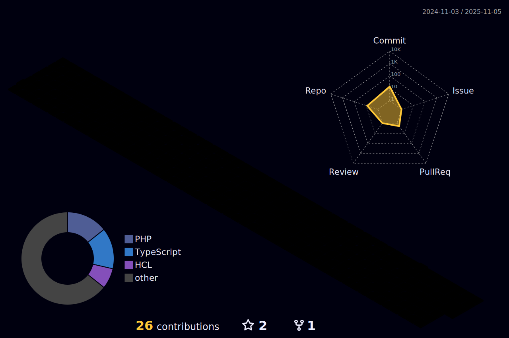

# 👋 Salut, je suis Dylan Weinachter

### 💻 Développeur passionné | 🚀 Open Source Enthusiast | 🎯 Problem Solver

---

## 🛠️ Tech Stack

---

## 🏙️ Contribution 3D

---

## 🐍 Snake eating my contributions

<picture>
  <source media="(prefers-color-scheme: dark)" srcset="https://raw.githubusercontent.com/TON-USERNAME/TON-USERNAME/output/github-snake-dark.svg" />
  <source media="(prefers-color-scheme: light)" srcset="https://raw.githubusercontent.com/TON-USERNAME/TON-USERNAME/output/github-snake.svg" />
  
</picture>

---

## 📊 GitHub Stats

---

## 🏆 GitHub Trophies

---

## 📈 Activity Graph

---

## 💡 Quote of the Day

---

## 📫 Contact & Social

---

### ⚡ Fun Fact
*Je code mieux avec du café ☕ et de la musique 🎵*

---

**Made with ❤️ and lots of ☕**

